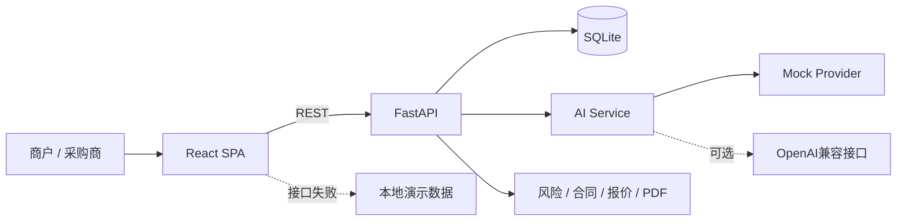

# Yiwu AI Trade Copilot

**义乌AI国际贸易智能体｜从交易效率提升到数字信任重构**

一个面向社会实践校赛路演的全栈高保真原型。系统把产品设计、数字展台、多语言接待、询盘、报价、风险、合同、订单、物流、售后与效果量化连成完整贸易闭环。默认 Mock 模式不需要任何外部 API 密钥，断网仍能完成核心演示。

> 核心主张：AI不仅帮助义乌商户卖得更快，也帮助他们卖得更放心。

所有企业、客户、订单与经营数据均为虚构演示数据；所有量化结论均清楚标记为 Demo 模拟测算或调研假设。

## 1. 调研背景与核心研究问题

过去的义乌贸易依赖见面、口碑与熟人网络建立人际信任。今天，商户开始使用AI生图、翻译、跨境平台、短视频和直播，获客与沟通显著提速；但客户身份、虚假询盘、拖欠货款、合同风险和线上信任仍缺少系统工具。

项目用“莫名其妙—无中生有—点石成金”映射三段演化：

1. 过去：人与人建立信任——人际信任；
2. 现在：数字工具提高效率——数字效率；
3. 未来：AI让风险可量化、可解释——AI数字信任。

核心研究问题是：**数字化提高贸易效率之后，义乌商户如何重新建立跨境交易信任？**

## 2. 已实现功能

- 路演首页：项目故事、过去/现在/未来时间轴、全链路闭环和模拟指标。
- AI老板驾驶舱：10项经营指标与8类可交互图表，Tooltip 适配投影展示。
- 产品与AI设计：产品库、详情抽屉、目标市场输入、完整AI产品方案和生成过程。
- 3D数字展台：5件程序化3D商品、拖拽/缩放/点击、主题与语言切换、询盘单、AI讲解、信用分；支持2D自动降级。
- AI多语言销售助手：中英西法俄阿语言入口、关键词驱动回复、推荐、议价、MOQ、交期、报价和风险提示；内置A/B/C三个路演场景。
- 客户与询盘：搜索、筛选、状态更新、风险/意向分、AI摘要、报价跳转和客户信用档案。
- 智能报价：数量、折扣、包装、运费、保险、税费和EXW/FOB/CIF实时计算；利润护栏、历史保存、中英文PDF。
- 数字信任中心：12类风险因子、0—100稳定评分、贡献明细、雷达图、付款与预付款建议、风险降低措施；内置4类客户。
- 合同审核：付款、交付、责任、仲裁、退款、账户与缺失条款的规则审核，输出安全版本示例。
- 订单与物流：订单进度时间轴；海运、班列、空运的费用、时效、风险、碳排放和推荐指数比较。
- 售后与复购：投诉、满意度、情感、处理状态、复购概率、关键词和营销建议。
- 效果量化：8项可调参数，实时估算时间、成本、响应、转化、成交额、风险损失和ROI，并公开公式口径。
- 调研成果：研究问题、方法、占位指标、核心发现、访谈金句结构、解决方案、社会价值、局限与推广路径。
- 路演模式：9步固定路径、讲解提示、进度、上一步/下一步、全屏和数据重置。
- 系统设置：API连接状态、Mock/Real模式说明、演示数据重置与应急开关。

## 3. 技术栈

| 层 | 技术 |
|---|---|
| 前端 | React 19、TypeScript、Vite、React Router、Axios、Recharts、React Three Fiber、Drei、Lucide、i18next |
| 后端 | Python、FastAPI、Uvicorn、SQLAlchemy 2、Pydantic 2、SQLite、ReportLab、python-dotenv、httpx |
| 测试 | pytest、FastAPI TestClient、TypeScript/Vite production build |
| 部署 | PowerShell、Batch、Bash、Docker、Docker Compose |

前端使用项目内的轻量 CSS 设计系统替代 Tailwind/shadcn。这样可以减少现场安装依赖与样式生成环节、保证离线投影效果，并保持全部组件、主题和响应式规则可直接修改；其余建议技术栈均已采用。

## 4. 系统架构



详细说明见 [`docs/architecture.md`](docs/architecture.md)。

## 5. 目录结构

```text
yiwu_trading_agent/
├── frontend/                 React + TypeScript SPA
│   ├── src/api/              Axios与离线回退
│   ├── src/components/       UI、图表与3D展台
│   ├── src/data/             前端应急演示数据
│   └── src/pages/            全部业务页面
├── backend/
│   ├── app/api/              REST路由
│   ├── app/core/             配置与数据库
│   ├── app/data/             初始化数据
│   ├── app/models/           SQLAlchemy模型
│   ├── app/schemas/          Pydantic请求模型
│   ├── app/services/         AI、风险、合同、报价、PDF、效果测算
│   ├── data/                 SQLite与调研指标JSON
│   └── tests/                后端测试
├── docs/                     架构、API、风险模型、路演与验收文档
├── scripts/                  Windows/Linux启动、环境检查与数据重置
├── docker-compose.yml
├── .env.example
└── README.md
```

## 6. 推荐环境

- Python：推荐 3.11 或 3.12；当前代码也通过 Python 3.14 环境验证时会在验收报告记录。
- Node.js：推荐 22 LTS；Node.js 20+ 均可。
- npm：推荐 10+。
- Docker：推荐 Docker Desktop / Engine 26+ 与 Compose v2。
- 浏览器：最新版 Chrome 或 Edge；3D场景需开启 WebGL。
- 系统：Windows 10/11、Ubuntu 22.04+ 或常见现代 Linux 发行版。

先检查环境：

```bash
python scripts/check_environment.py
```

## 7. Windows 一键启动

在项目根目录运行：

```powershell
powershell -ExecutionPolicy Bypass -File .\scripts\start_windows.ps1
```

也可以双击或运行：

```bat
scripts\start_windows.bat
```

脚本会创建 `.venv`、安装缺失依赖、隐藏启动后端，再在当前窗口启动前端。按 `Ctrl+C` 停止。

## 8. Linux / macOS 启动

```bash
chmod +x scripts/start_linux.sh
./scripts/start_linux.sh
```

脚本会创建虚拟环境、安装依赖、后台启动 FastAPI，并在前台运行 Vite。按 `Ctrl+C` 停止两端服务。

## 9. 手动开发启动

后端终端：

```powershell
python -m venv .venv
.\.venv\Scripts\python.exe -m pip install -r backend\requirements.txt
cd backend
..\.venv\Scripts\python.exe -m uvicorn app.main:app --reload --port 8000
```

前端终端：

```powershell
cd frontend
npm install
npm run dev
```

Linux 将 `.venv\Scripts\python.exe` 改为 `.venv/bin/python`。

## 10. Docker Compose

安装 Docker 后：

```bash
docker compose up --build
```

停止：

```bash
docker compose down
```

数据库文件通过 `backend/data` 目录持久化。

## 11. 访问地址

- 前端：<http://localhost:5173>
- 后端：<http://localhost:8000>
- Swagger：<http://localhost:8000/docs>
- 健康检查：<http://localhost:8000/api/health>

## 12. 环境变量

复制 `.env.example` 为 `.env`，按需修改：

| 变量 | 默认值 | 说明 |
|---|---|---|
| `AI_PROVIDER` | `mock` | `mock` 或 `openai` |
| `OPENAI_API_KEY` | 空 | 真实接口密钥，禁止提交Git |
| `OPENAI_BASE_URL` | 官方兼容地址 | 可替换其他OpenAI兼容服务 |
| `OPENAI_MODEL` | `gpt-4.1-mini` | 真实模式使用的模型名 |
| `DATABASE_URL` | 本地SQLite | SQLAlchemy数据库地址 |
| `FRONTEND_ORIGINS` | localhost:5173 | 逗号分隔的CORS来源 |
| `VITE_API_BASE_URL` | localhost:8000/api | 前端API根地址 |

`.env` 已加入 `.gitignore`。

## 13. Mock 模式与真实 AI 接入

Mock 是默认且推荐的路演模式：

```env
AI_PROVIDER=mock
```

它用关键词、场景和稳定规则完成产品生成、销售对话、摘要、合同与跟进建议。回复并非固定一句：环保、价格、降价、交期、报价、货到付款、拒绝验证等关键词会触发不同逻辑。

真实AI入口位于 `backend/app/services/ai_service.py`。启用：

```env
AI_PROVIDER=openai
OPENAI_API_KEY=your-secret-key
OPENAI_BASE_URL=https://api.openai.com/v1
OPENAI_MODEL=your-model-name
```

真实调用失败、超时或输出异常时会自动回落到 `MockAIProvider`，页面不会崩溃。

## 14. 数据库初始化与重置

首次启动自动创建 SQLite 表并插入演示数据。手动重置：

```powershell
.\.venv\Scripts\python.exe scripts\init_demo_data.py
```

Linux：

```bash
.venv/bin/python scripts/init_demo_data.py
```

也可以在“系统设置”点击“重置全部演示数据”，或调用：

```bash
curl -X POST http://localhost:8000/api/demo/reset
```

调研占位指标位于 `backend/data/research_metrics.json`，后续直接替换 `value` 即可。

## 15. 风险评分模型

风险分为 0—100：0—29低、30—59中、60—79高、80—100极高。模型综合注册年限、资料完整度、历史成交、纠纷、付款方式、金额异常、地址、邮箱、账户变更、验证拒绝、异常紧迫性和行为一致性。每个因子均返回贡献值和原因，便于路演解释。

完整权重与免责声明见 [`docs/risk-model.md`](docs/risk-model.md)。该模型不构成真实征信或商业决策依据。

## 16. 量化指标计算口径

- 日节省时间 = 每日询盘 ×（人工回复时间 + 35% × 人工报价时间）× AI自动处理比例 ÷ 60。
- 月节省人工成本 = 日节省小时 × 22个工作日 × 人工时薪。
- 月新增有效询盘 = 月询盘 × AI自动处理比例 × 8%效率增量假设。
- 转化率模拟提升 = AI自动处理比例 × 3.8个百分点，上限4.5个百分点。
- 月新增成交额 = 新增有效询盘 × 提升后的转化率 × 平均订单金额。
- 减少高风险损失 = 月询盘 × 虚假询盘比例 × 2.5%损失事件假设 × 客单价 × AI处理比例。
- ROI =（人工节省 + 新增成交额的12%贡献毛利 + 避免损失 − ¥2,800模拟月投入）÷ 模拟月投入。

默认参数可在 `backend/app/schemas/common.py` 和前端效果量化页的初始状态中调整。全部结果仅为模拟估算。

## 17. 推荐路演路径

首页 → 老板驾驶舱 → AI产品设计 → 3D数字展台 → AI销售助手场景A/C → 智能报价与PDF → 数字信任中心极高风险客户 → 订单看板 → 效果量化 → 调研成果。

系统内“路演模式”提供9步导航、讲解提示、全屏和数据重置。完整8分钟、3分钟和失败应急脚本见 [`docs/demo-script.md`](docs/demo-script.md)。

## 18. API 与开发文档

- API速查：[`docs/api.md`](docs/api.md)
- 架构说明：[`docs/architecture.md`](docs/architecture.md)
- 风险模型：[`docs/risk-model.md`](docs/risk-model.md)
- 验收报告：[`docs/acceptance-report.md`](docs/acceptance-report.md)

## 19. 测试

后端：

```powershell
.\.venv\Scripts\python.exe -m pytest backend\tests -q
```

前端生产构建：

```bash
cd frontend
npm run build
```

验收结果以 `docs/acceptance-report.md` 为准，不把未验证项目写成成功。

## 20. 截图位置

路演截图统一放在 `docs/screenshots/`。建议保存：首页、驾驶舱、3D/2D展台、销售助手场景C、报价、风险中心与效果量化各一张。仓库不预置大体积二进制截图，便于后续使用真实调研数据后重新截取。

## 21. 已知限制

- 不接入真实工商征信、支付、物流、邮件或WhatsApp。
- 3D商品为程序化几何体，不是生产级产品模型。
- 多语言Mock回复以场景和规则为主，不等同专业翻译。
- 合同审核是规则提示，不构成法律意见。
- 风险评分是教学模型，不可直接用于真实授信或拒绝交易。
- 调研数量和比例仍是清晰占位符，需要团队回填真实结果。
- Docker 配置已提供，但若当前机器未安装 Docker，则无法在该机器现场验证。

## 22. 后续扩展

- 接入可信工商、海关、物流、汇率与出口信用保险数据。
- 让真实商户参与权重校准与原型可用性测试。
- 加入图片生成、产品图检索、语音接待和实时翻译。
- 加入报价审批、合同版本管理与履约预警。
- 把交易历史沉淀为合规、可授权、可撤销的信用资产。
- 形成面向义乌产业带的轻量SaaS和公共数字服务工具。

项目专属社交预览封面位于 `frontend/public/og.png`，使用内置图像生成工具创建，提示词围绕深蓝/青色国际贸易网络、可解释数字信任盾牌和项目三行准确标题；如果部署到正式域名，请把 `frontend/index.html` 中的相对 `og:image` 地址改成正式绝对URL。

## 23. 常见问题

**5173或8000端口被占用**：先运行 `python scripts/check_environment.py`，结束占用进程；本项目启动脚本固定使用这两个端口。

**页面显示 OFFLINE DEMO**：说明后端未连接，但核心路演仍可继续。检查 `http://localhost:8000/api/health`，再确认 `.env` 和防火墙。

**3D页面黑屏**：点击“2D降级演示”；更新Chrome/Edge并确认硬件加速已开启。

**PDF按钮使用浏览器打印**：说明后端暂不可达。启动FastAPI后可获得ReportLab生成的真实PDF文件。

**真实AI报错**：将 `AI_PROVIDER` 改回 `mock`；或核对密钥、Base URL和模型名。系统会自动降级，但路演前仍建议使用Mock。

**中文PDF字体异常**：项目使用 ReportLab 内置 `STSong-Light` CID 字体；如目标环境的PDF阅读器兼容性异常，可改为注册本地Noto Sans CJK字体。

## 24. 免责声明

本项目是社会实践、教学和路演原型，不是生产商业系统。所有企业、个人、订单、信用、风险、物流、成本、利润和效果数据均为虚构或模拟；风险结果不构成真实征信或商业决策，合同结果不构成法律意见，量化效果不代表真实收益。真实部署前必须完成数据合规、安全、隐私、模型验证、法律与业务审计。
