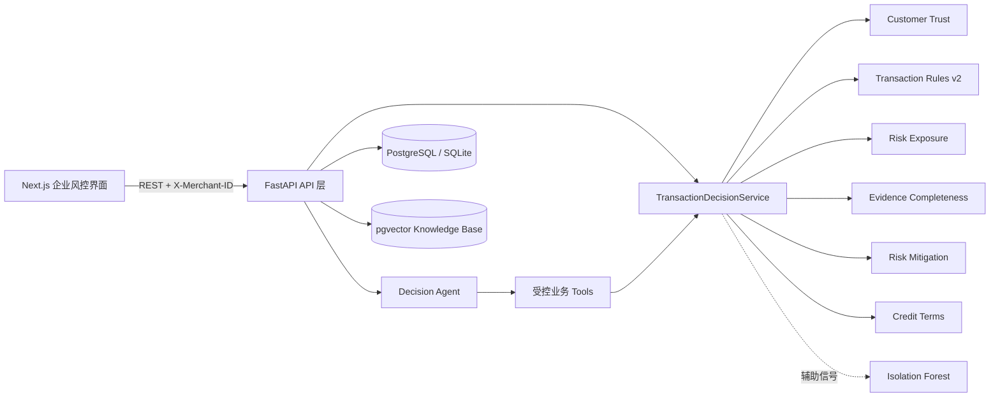

# TradeGuard AI 跨境交易授信与风险决策智能体

TradeGuard AI 是一个面向跨境交易商户的授信与风险决策智能体。

它不判断客户是不是骗子，而是帮助商户：

- 识别客户并读取历史履约事实；
- 判断当前订单是否偏离历史与规则；
- 计算当前及预计最大风险敞口；
- 检查关键证据是否完整；
- 评估保险、担保、信用证等真实风险缓释；
- 设计更安全的定金、账期和发货条件。

> 所有结论都是辅助决策信息，不是欺诈认定。暂停发货、放行、授信或加入黑名单等动作必须由商户人工确认。

## 核心能力

- **Customer Trust v2**：展示合作时长、交易次数、历史金额、可验证的按期付款率、逾期、退款、纠纷与数据缺口；旧信用分仅保留为参考。
- **Transaction Risk**：`rules_v2` 确定性规则优先，覆盖首次授信、低定金、长账期、付款主体不一致、付款账户变化、金额超历史最大值等条件。
- **Risk Exposure**：按已发货/计划发货货值、已确认收款和已验证保障计算敞口，结果不允许为负数。
- **Evidence Completeness**：按场景生成必需证据，关键证据缺失不会被大量普通材料掩盖。
- **Risk Mitigation**：只允许币种一致且已验证的保险、担保、信用证、平台保障或托管抵扣敞口。
- **Credit Terms**：输出建议定金、账期、分批发货和人工复核条件，不代替人工审批。
- **Decision Agent**：从自然语言抽取交易条件，按会话保存结构化 Decision Context，缺字段时一次追问一个关键问题；“如果把定金提高到 40%”只做模拟，不修改正式交易。
- **Evidence Package**：固化客户、订单、合同、付款、发货、验货、脱敏沟通摘要、延期、纠纷与时间线，支持 JSON 和可打印 HTML。
- **RAG**：知识库只存非结构化风控知识；客户、交易、评分、规则和事件继续保存在关系数据库。

## 架构



LLM 不访问数据库、不执行 SQL、不计算风险分，也不修改业务数据。Agent 只能通过白名单 Tool 获取确定性服务结果，再负责追问、编排和解释。

## 目录

```text
backend/app/api/             FastAPI 路由与租户边界
backend/app/risk/            信任、规则、异常、敞口、证据、缓释、条款和决策服务
backend/app/agent/           Decision Context、状态图、Tool、Prompt、Mock/LLM 接口
backend/app/services/        数据网关、会话、知识库、证据包和审计服务
backend/alembic/             数据库迁移
backend/tests/               后端单元与接口测试
frontend/app/                Next.js App Router 页面入口
frontend/components/pages/   工作台、客户、交易、决策、预警、Agent 页面
ml/                          Isolation Forest 特征、训练与模型注册
scripts/                     初始化与 Windows/Linux 启停脚本
docs/                        架构、引擎、Agent、数据字典和验收说明
```

## Windows 快速启动

要求 Python 3.11+ 和 Node.js 20+。首次启动脚本会创建 `.venv`、安装依赖、执行迁移、初始化演示数据并启动前后端。

```powershell
cd E:\project\yiwu_trading_agent
powershell -ExecutionPolicy Bypass -File scripts/start_windows.ps1
```

访问：

- Web：<http://localhost:3000>
- Swagger：<http://localhost:8000/docs>
- 健康检查：<http://localhost:8000/health>

停止：

```powershell
powershell -ExecutionPolicy Bypass -File scripts/stop_windows.ps1
```

## Linux / macOS 快速启动

```bash
chmod +x scripts/start.sh scripts/stop.sh
./scripts/start.sh
# 停止
./scripts/stop.sh
```

## Docker Compose

```powershell
Copy-Item .env.example .env
docker compose up --build
```

Linux/macOS 使用 `cp .env.example .env`。`docker compose down -v` 会删除容器数据库卷，只可在确定需要清空数据时使用。

## 环境配置与 LLM

`.env.example` 是可提交的配置模板，程序实际读取项目根目录 `.env`。`.env` 已在 `.gitignore` 中，禁止把真实 Key 写入 `.env.example`。

没有 Key 时仍可运行确定性 Tool 与状态机，但不会生成 LLM 回答：

```env
AGENT_MODE=deterministic
```

DeepSeek 等 OpenAI-compatible 服务示例：

```env
AGENT_MODE=llm
LLM_API_KEY=替换为真实密钥
LLM_BASE_URL=https://api.deepseek.com
LLM_MODEL=deepseek-chat
LLM_TIMEOUT_SECONDS=60
LLM_MAX_RETRIES=2
```

修改 `.env` 后必须重启后端。启用 LLM 模式后，每次用户可见回答都由 DeepSeek 基于受控 Tool 证据生成，包括交易条件追问、授信分析和条件调整；交易评分、风险规则和敞口计算仍始终由确定性 Tool 执行。DeepSeek 服务不可用、密钥无效或响应无法解析时，接口会返回明确的 `llm-error:*`，不会生成本地替代回答。

## 数据库迁移与初始化

Windows：

```powershell
.\.venv\Scripts\python.exe -m alembic -c backend/alembic.ini upgrade head
.\.venv\Scripts\python.exe scripts/init_data.py
```

Linux/macOS：

```bash
.venv/bin/python -m alembic -c backend/alembic.ini upgrade head
.venv/bin/python scripts/init_data.py
```

本地未配置 `.env` 时默认使用 SQLite；复制 `.env.example` 后默认连接 PostgreSQL，请确保数据库已启动或把 `DATABASE_URL` 改为 `sqlite:///./tradeguard_dev.db`。

## 主要 API

业务请求默认使用 `X-Merchant-ID: 1`，Agent 会话还使用 `X-User-ID`。

| 能力 | 方法与路径 |
|---|---|
| 客户信任 | `GET /api/customers/{id}/trust` |
| 正式/草稿决策 | `POST /api/decisions/evaluate` |
| 条件模拟 | `POST /api/decisions/simulate` |
| 交易敞口与决策 | `GET /api/transactions/{id}/exposure`、`GET .../decision` |
| 交易条款 | `GET/PUT /api/transactions/{id}/terms` |
| 证据与缓释 | `GET/POST /api/transactions/{id}/evidence`、`GET/POST .../mitigations` |
| 交易时间线 | `GET /api/transactions/{id}/timeline` |
| 证据包 | `POST /api/transactions/{id}/evidence-package`、`GET ...?format=json|html` |
| Agent | `POST /api/agent/chat`、`GET /api/agent/history/{conversation_id}` |
| 旧风险检测兼容接口 | `POST /api/risk/analyze-order` |

完整请求/响应 Schema 可在 Swagger 中直接查看和调用。

## 测试与生产构建

Windows：

```powershell
.\.venv\Scripts\python.exe -m pytest backend/tests -q
npm --prefix frontend run lint
npm --prefix frontend run typecheck
npm --prefix frontend run build
```

Linux/macOS 将 Python 路径替换为 `.venv/bin/python`。

## 推荐验收流程

1. 打开 `/agent`，输入“一个迪拜客户第一次合作，准备做 3 万美元订单，希望给 45 天账期”。
2. 依次补充“20% 定金，身份已核验，合同已签”和“付款主体与合同一致”。
3. 查看 Customer Trust、Transaction Risk、Risk Exposure、Evidence 和 Credit Terms 的工具证据。
4. 输入“如果把定金提高到 40% 呢？”，检查调整前后敞口差异，确认正式交易未被修改。
5. 在 `/risk-check` 直接评估或模拟交易条件；在客户详情页查看 Customer Trust；在工作台查看敞口型指标。

详细设计见 [系统架构](docs/architecture.md)、[风控引擎](docs/risk-engine.md)、[Agent 框架](docs/agent-framework.md)、[数据字典](docs/data-dictionary.md) 和 [验收报告](docs/acceptance-report.md)。
