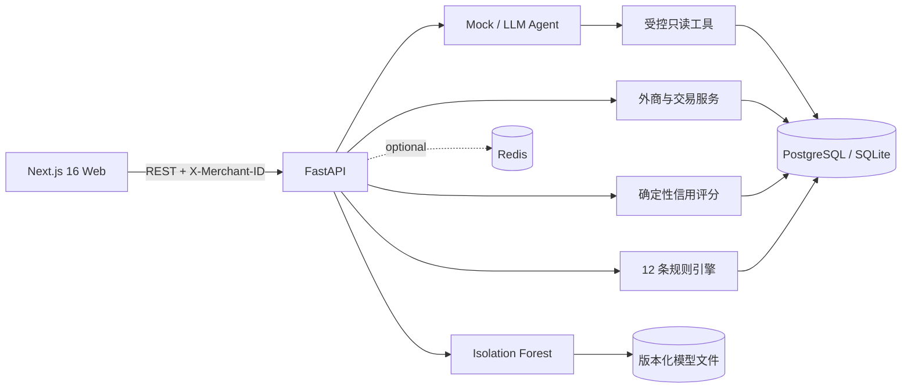

# TradeGuard AI 外贸风控智能体

一个面向外贸商户的可运行风控 MVP：用确定性信用评分、12 条可配置规则、Isolation Forest 异常检测和只读工具型 Agent，把外商档案、交易、风险证据与人工处置串成闭环。项目内置完全虚构且可复现的路演数据，不声称连接真实征信或海关系统。

> 风险分、异常度和 Agent 回复仅用于辅助核验，不代表欺诈结论。暂停发货、加入黑名单等高风险动作必须由用户明确确认。

## 能演示什么

- 20 个虚构外商、300 笔交易、10 条以上预警，固定随机种子可重复生成。
- 100 分制信用评分：履约 30%、稳定性 20%、纠纷退款 20%、身份完整性 15%、合作关系 15%，同时展示置信度与版本。
- 12 条可复现规则，包括金额突增、小单转大单、频繁换地址、拆单、资料变更后大额下单等。
- Isolation Forest 使用与线上推理完全一致的 14 个特征，模型不可用时自动退化到统计异常分。
- Mock Agent 开箱即用；配置兼容接口后可切换 LLM 工具调用。Agent 不能直接执行 SQL 或自动采取黑名单/暂停发货动作。
- 8 个响应式页面：工作台、外商档案、外商详情、交易管理、新订单风险检测、风险预警、AI 风控助手、路演场景。
- 商户数据通过 `X-Merchant-ID` 隔离；风险事件和处置写入审计日志。

## 架构



生产式容器使用 PostgreSQL + Redis；为方便校赛现场演示，本地未配置 `.env` 时自动使用项目根目录的 SQLite，Redis 不可用也不会阻断核心功能。

## 目录

```text
backend/                 FastAPI、SQLAlchemy、Alembic、风险引擎、Agent、测试
frontend/                Next.js App Router、Tailwind、TanStack Query、Zustand、ECharts
ml/                      特征工程、Isolation Forest 训练/评估、模型注册表
sample_data/             可上传的交易模板
scripts/                 初始化及 Windows/Linux 启停脚本
docs/                    架构、风控、安全、数据字典、路演与验收说明
docker-compose.yml       PostgreSQL、Redis、后端和前端编排
```

## 最快启动：Docker Compose

要求 Docker Desktop / Docker Engine 与 Compose 插件。

```bash
cp .env.example .env
docker compose up --build
```

Windows PowerShell 可用：

```powershell
Copy-Item .env.example .env
docker compose up --build
```

启动后访问：

- Web：<http://localhost:3000>
- Swagger：<http://localhost:8000/docs>
- ReDoc：<http://localhost:8000/redoc>
- 健康检查：<http://localhost:8000/health>

关闭：`docker compose down`。若需要同时清除容器数据库卷，使用 `docker compose down -v`；该命令会删除容器内数据。

## 本地启动

需要 Python 3.11+、Node.js 20+。不要创建 `.env` 即可使用 SQLite 零依赖模式。

Windows：

```powershell
powershell -ExecutionPolicy Bypass -File scripts/start_windows.ps1
# 停止
powershell -ExecutionPolicy Bypass -File scripts/stop_windows.ps1
```

Linux/macOS：

```bash
chmod +x scripts/start.sh scripts/stop.sh
./scripts/start.sh
# 停止
./scripts/stop.sh
```

手动启动方式：

```bash
python -m venv .venv
# Windows: .venv\Scripts\activate
# Linux/macOS: source .venv/bin/activate
pip install -r backend/requirements.txt
npm --prefix frontend install
python scripts/init_data.py
python -m uvicorn backend.app.main:app --reload --port 8000
```

另开终端：

```bash
npm --prefix frontend run dev
```

若复制了 `.env.example`，本地后端会连接其中的 PostgreSQL 地址；请先启动 PostgreSQL，或把 `DATABASE_URL` 改为 `sqlite:///./tradeguard_dev.db`。

## 数据库迁移与演示数据

```bash
alembic -c backend/alembic.ini upgrade head
python scripts/init_data.py
```

应用启动也会自动建表并在空数据库中初始化演示数据。初始化是幂等的；已有商户时不会重复写入。演示数据使用固定随机种子 42，包含经过设计的异常交易模式。

如需明确丢弃当前 TradeGuard 表并恢复路演基线，可运行 `python scripts/init_data.py --reset`。这是破坏性操作，只应对本地/演示数据库使用。

## 训练和评估异常模型

```bash
python -m ml.training.train_isolation_forest
python -m ml.evaluation.evaluate_model
```

模型保存在 `ml/artifacts/isolation_forest.joblib`（被 Git 忽略），元数据保存在 `ml/artifacts/metadata.json`。后端在模型缺失且数据库已有至少 30 条可训练记录时也会自动训练；训练失败时使用可解释统计分，不中断 API。

## Agent 模式

默认无需密钥：

```env
AGENT_MODE=mock
```

切换兼容 OpenAI Chat Completions 工具调用的服务：

```env
AGENT_MODE=llm
LLM_API_KEY=your-key
LLM_BASE_URL=https://api.openai.com/v1
LLM_MODEL=your-tool-calling-model
```

LLM 仅能调用白名单工具读取客户档案、信用分、交易、预警和核验清单。密钥缺失、服务异常或输出不可解析时会安全回退 Mock Agent。

## 常用 API

所有业务请求默认携带 `X-Merchant-ID: 1`。

| 能力 | 方法与路径 |
|---|---|
| 健康/模型 | `GET /health`、`GET /api/system/model` |
| 外商 CRUD | `GET/POST /api/customers`、`GET/PUT/DELETE /api/customers/{id}` |
| 信用评分 | `GET /api/customers/{id}/credit-score`、`POST .../recalculate` |
| 交易与导入 | `GET/POST /api/transactions`、`POST /api/transactions/import` |
| 订单检测 | `POST /api/risk/analyze-order` |
| 预警闭环 | `GET /api/risk/alerts`、`PUT /api/risk/alerts/{id}/status` |
| 工作台 | `GET /api/risk/dashboard` |
| 路演场景 | `GET /api/risk/demo-scenarios`、`POST .../{code}/run` |
| Agent | `POST /api/agent/chat` |

完整请求/响应模型和可交互调用请直接使用 Swagger。

## 测试与构建

```bash
python -m pytest backend/tests -q
npm --prefix frontend run lint
npm --prefix frontend run typecheck
npm --prefix frontend run build
```

## 路演建议

从“路演场景”运行“小额试单后突然大额采购”，展示规则证据、模型异常度与整体风险分；再进入“风险预警”指派人工核验，最后在“AI 风控助手”选择对应外商，让 Agent 说明数据来源。完整 5 分钟脚本见 [docs/demo-script.md](docs/demo-script.md)。

## 常见问题

**Swagger 是什么？** 它是 FastAPI 自动生成的交互式 API 文档。打开 `/docs`，展开接口并点击 “Try it out” 即可直接发请求。

**没有 Redis 或模型还能运行吗？** 可以。Redis 当前是可选扩展；模型缺失时后端可自动训练，训练不可用时退化到统计异常分。

**为何不自动认定欺诈？** 演示数据和算法只覆盖异常迹象，不具备真实征信、制裁名单、海关或银行证据。系统因此只给核验建议，并强制关键动作人工确认。

**如何接真实业务？** 先接入真实身份核验、订单和履约数据，再按合规要求增加鉴权、权限、加密、数据保留策略和模型监控；不要直接把演示阈值用于生产决策。

## 后续路线

- OAuth/OIDC 登录、角色权限与商户管理后台
- PostgreSQL 行级安全、对象存储与附件证据链
- 制裁/工商/物流数据连接器及数据授权记录
- 可视化规则编排、版本发布和回放评估
- 模型漂移监控、人工反馈闭环与冠军/挑战者模型
- 多语言报告导出和异步任务队列

更多设计说明见 [docs/architecture.md](docs/architecture.md)、[docs/risk-engine.md](docs/risk-engine.md) 和 [docs/agent-safety.md](docs/agent-safety.md)。
