# AI Agent 决策框架

## 定位

Agent 是交易决策流程的自然语言入口和编排器，不是风险计算器。它负责抽取字段、识别缺失信息、主动追问、调用 Tool 和引用结果解释；所有 Trust、规则、敞口、证据和条款结果来自确定性服务。

## 状态图

```mermaid
flowchart LR
  START --> LOAD["Load Context"]
  LOAD --> INTENT["Intent Detection"]
  INTENT --> EXTRACT["Context Extraction"]
  EXTRACT --> MERGE["Context Merge"]
  MERGE --> RESOLVE["Resolve Customer"]
  RESOLVE --> REQUIRED["Required Fields"]
  REQUIRED --> QUESTION["Next Best Question"]
  QUESTION -->|信息不足| SAVE["Save Context"]
  QUESTION -->|信息足够| SELECT["Tool Selection"]
  SELECT --> EXECUTE["Tool Execution"]
  EXECUTE --> EVIDENCE["Evidence Collection"]
  EVIDENCE --> RESPONSE["Response Generation"]
  RESPONSE --> SAVE
  SAVE --> END
```



当前未强制依赖 LangGraph，`AgentDecisionGraph.invoke(state)` 使用兼容 LangGraph 思路的同步状态机。每个节点将可序列化 State 写入 `state_history`，并通过 `call_chain` 返回调用链，未来可替换为正式 LangGraph compiled graph。

## Decision Context

State 和数据库上下文包含：消息、客户/交易 ID、意图、结构化 `transaction_context`、已知/必需/缺失字段、完整度、下一最佳问题、Tool 调用、Tool 结果、证据和最终回答。

`agent_decision_contexts` 与 `agent_messages` 分开存储。前者是可演进的业务字段状态，后者是脱敏聊天记录。后续轮次先加载 Context，再将当前消息抽取的增量字段合并；因此“20%”可补齐上一轮定金问题，“如果提高到 40%”可识别为模拟调整。

## 统一接口

```http
POST /api/agent/chat
X-Merchant-ID: 1
X-User-ID: demo-user
Content-Type: application/json
```

```json
{
  "message": "一个迪拜客户第一次合作，准备做3万美元订单，希望给45天账期",
  "customer_id": "",
  "conversation_id": "credit-review-001"
}
```

响应除兼容字段外，还包含 `transaction_context`、`known_fields`、`missing_fields`、`information_completeness`、`next_best_question`、`decision_result`、`comparison`、`call_chain` 和 `state_history`。

## 交易决策 Tools

| Tool | 作用 |
|---|---|
| `get_customer_profile` | 客户档案 |
| `get_customer_credit_score` | legacy 信用评分参考 |
| `get_customer_transactions` | 历史交易 |
| `get_order_risk_analysis` | 兼容的既有订单风险分析 |
| `list_risk_alerts` | 风险预警 |
| `compare_customers` | 客户风险事实对比 |
| `generate_verification_checklist` | 人工核验清单 |
| `get_transaction_risk` | 规则化交易风险 |
| `calculate_risk_exposure` | 当前/预计风险敞口 |
| `get_evidence_completeness` | 必需证据与关键缺失 |
| `evaluate_credit_terms` | 完整交易决策链 |
| `simulate_transaction_adjustment` | 条款调整前后模拟，不写数据库 |
| `get_transaction_timeline` | 可验证付款/发货/到期/纠纷时间线 |
| `search_risk_knowledge` | 非结构化风控知识检索 |

每个 Tool 均有 Pydantic 输入/输出 Schema、中文说明、统一异常结构和白名单注册。Tool 本身不复制风险算法，通过 `AgentDataGateway` 调用 Agent 包外的已有业务服务。

## 多轮示例

```text
用户：第一次合作，3万美元，45天账期
Agent：请补充定金比例。

用户：20%定金，身份已核验，合同已签
Agent：请确认付款主体是否与合同主体一致。

用户：一致
Agent：调用 evaluate_credit_terms，引用首次授信、长账期、低定金、24000 USD 预计敞口和证据完整度输出建议。

用户：如果定金提高到40%呢？
Agent：识别 modify_transaction_terms，调用 simulate_transaction_adjustment，展示 before/after；不创建订单，不更新条款。
```

## Mock 与 LLM

`AGENT_MODE=deterministic` 仅用于离线测试，运行确定性抽取、追问和 Tool。`AGENT_MODE=llm` 时，所有用户可见回答都由 DeepSeek/OpenAI-compatible Provider 基于 Tool 证据生成；交易条件抽取、缺失字段判断、风险敞口和授信计算仍由确定性状态机完成，再交给模型整理表达。Provider 失败时返回明确错误，不生成本地替代回答。未来 Claude Provider 只需实现统一接口。

LLM 不可用、无 Key、输出不可解析或没有合规 Tool 证据时，系统回退 Mock。回退不影响确定性决策结果。

## 安全边界

- Agent 包不获得数据库 Session，不执行 SQL；
- LLM 不直接访问客户/交易表，不计算信用分或风险分；
- 读写业务数据必须经过带 `merchant_id` 的网关或 API；
- 模拟 Tool 不持久化正式交易或条款；
- 消息入库前脱敏邮箱、电话、地址、账号、长数字和 API Key；
- Tool Memory 只存 Tool 名、状态、摘要和允许的标识参数，不存完整返回；
- 黑名单、放行、暂停发货和正式授信始终需要人工操作。

## RAG 边界

`knowledge_base` 只保存外贸案例、义乌市场经验、合同风险规则和风控操作规范的文本块及向量。交易事实永远通过 SQL 业务服务查询，不复制进向量库。回答必须区分“结构化业务事实”和“非结构化知识参考”。
