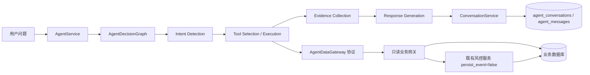

# AI Agent 基础框架

## 执行链路



`backend.app.agent` 不导入 SQLAlchemy、ORM 模型、数据库 Session、信用评分服务或风险计算服务。API 层将 `SqlAlchemyAgentDataGateway` 注入 Agent，工具得到的都是普通字典和证据引用。

## 目录职责

- `service.py`：统一编排、模式选择、证据汇总、响应兼容。
- `intent.py`：确定性意图识别，保证无模型时可演示。
- `graph.py`：LangGraph 风格的 Agent State、节点、检查点和零依赖状态机。
- `tools.py`：7 个核心 Tool 与 1 个兼容 Tool；每个 Tool 都有独立 Pydantic 输入/输出 Schema、中文说明和统一异常封装。
- `prompts.py`：Prompt 版本、安全边界和用户上下文模板。
- `schemas.py`：Agent 内部协议，不包含数据库类型。
- `mock_agent.py`：本地确定性回答。
- `llm_agent.py`：`LLMProvider` 接口与 OpenAI-compatible 实现。
- `conversation.py`：按 Merchant 隔离的线程安全内存会话管理。
- `services/agent_data.py`：Agent 包外的只读业务数据网关实现。

## 统一聊天接口

```http
POST /api/agent/chat
Content-Type: application/json
X-Merchant-ID: 1
```

```json
{
  "message": "为什么这个客户最近被评为高风险？",
  "customer_id": "5",
  "conversation_id": "roadshow-main"
}
```

核心返回字段：

```json
{
  "answer": "...",
  "tools_used": ["get_customer_profile", "get_customer_credit_score", "list_risk_alerts"],
  "evidence": [{"source_type": "risk_event", "source_id": "1", "summary": "..."}],
  "related_customer": {"id": 5, "company_name": "...", "country": "..."},
  "related_orders": [75],
  "risk_events": [1]
}
```

响应暂时同时保留 `tools_called`、`data_sources` 和 `related_*_ids`，确保现有前端无需同步修改。

## 决策图与 State

当前依赖中没有 LangGraph，因此 `AgentDecisionGraph` 使用同步状态机实现，并提供与 CompiledGraph 相同风格的 `invoke(state)` 接口。`build_agent_graph()` 是统一构建入口，未来安装 LangGraph 后可在不改变 API 和 Tool 契约的情况下替换执行后端。

执行节点固定为：

```text
START
  -> Intent Detection
  -> Tool Selection
  -> Tool Execution
  -> Evidence Collection
  -> Response Generation
  -> END
```

每个节点都会保存完整可序列化快照，State 至少包含：

```json
{
  "message": "为什么这个客户风险高",
  "customer_id": 5,
  "intent": "risk_analysis",
  "tool_calls": [],
  "tool_results": [],
  "evidence": [],
  "final_answer": ""
}
```

`POST /api/agent/chat` 通过 `call_chain` 返回紧凑调用链，通过 `state_history` 返回逐节点快照。风险问题未提供订单 ID 时，图只能先调用 `get_customer_transactions` 获取最近订单，再调用 `get_order_risk_analysis`；该解析过程不会绕过 Tool 访问数据库。

Response Generation 使用确定性模板读取 Tool 的结构化字段，并追加 `source_type`、`source_id` 和证据摘要。目标 Tool 调用失败时，即使前置实体解析 Tool 成功，也必须返回“数据不足”，不能生成风险结论。

## 会话接口

- `POST /api/agent/conversations`
- `GET /api/agent/conversations`
- `GET /api/agent/conversations/{conversation_id}`
- `GET /api/agent/history/{conversation_id}`
- `DELETE /api/agent/conversations/{conversation_id}`

正式 API 使用数据库持久化 Conversation Memory：`agent_conversations` 保存商户、用户、外部会话 ID 和时间信息，`agent_messages` 保存脱敏后的角色、内容及安全 Tool 调用元数据。服务重启后可根据 `conversation_id` 恢复消息，并在后续请求未传 `customer_id` 时恢复既有客户上下文。

所有查询同时按 `X-Merchant-ID` 和 `X-User-ID` 隔离；演示环境未传 `X-User-ID` 时使用 `demo-user`。邮箱、电话、地址、证件/注册/银行编号、长数字和 API Key 等凭证在写入数据库前替换为脱敏标记。Tool Memory 只保存 Tool 名称、成功状态、摘要和 `customer_id`、`order_id` 等白名单参数，不保存 Tool 完整返回值。

`backend/app/agent/conversation.py` 仍保留进程内 `ConversationManager`，仅作为不经过 API 的本地回退实现；Agent Service 通过 `ConversationStore` 协议与数据库实现解耦。

## 安全边界

- 档案、信用、交易、预警、对比和清单 Tool 只读取已有业务数据。
- 订单风险 Tool 经 Agent 包外网关调用现有 `RiskAssessmentService`，强制 `persist_event=false`，复用已有规则引擎与异常检测，不复制算法。
- 订单风险 Tool 调用前必须存在历史信用评分；无评分时返回数据不足，避免 `latest_or_calculate` 触发补算。
- Agent 不执行 SQL，不获得数据库 Session。
- LLM 不直接调用风险规则、异常模型或综合评分服务，只能调用白名单 Tool。
- Tool Registry 拒绝未注册工具并限制参数。
- 高风险处置继续由原有人工确认 API 完成。
- LLM 未调用工具或服务异常时回退 Mock，不接受无证据的自由回答。

## 模型扩展

`LLMProvider.complete(messages, tools)` 是统一模型接口。当前 `OpenAICompatibleProvider` 可连接 GPT 或兼容接口的 Qwen；后续 Claude、原生 Qwen 等 Provider 只需实现该协议，不需要修改 Agent Service 和工具层。

## Tool 契约

七个核心 Tool：

1. `get_customer_profile`
2. `get_customer_credit_score`
3. `get_customer_transactions`
4. `get_order_risk_analysis`
5. `list_risk_alerts`
6. `compare_customers`
7. `generate_verification_checklist`

`get_risk_event_detail` 是为现有 MVP 会话保留的兼容 Tool。所有 Tool 的 LLM JSON Schema 都直接由输入模型生成并拒绝额外字段；成功结果通过输出模型再次校验。失败统一返回 `success=false` 及 `error.code`、`error.message`，错误码包括 `TOOL_NOT_ALLOWED`、`TOOL_INPUT_INVALID`、`BUSINESS_DATA_NOT_FOUND`、`TOOL_EXECUTION_ERROR` 和 `TOOL_OUTPUT_INVALID`。
