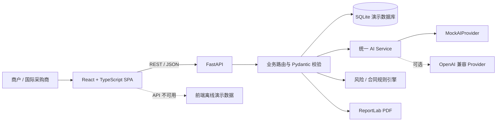

# 系统架构

Yiwu AI Trade Copilot 采用前后端分离、Mock 优先的结构。浏览器访问 React SPA；页面优先调用 FastAPI，接口临时不可用时回退到前端预置数据。后端通过 SQLAlchemy 访问 SQLite，并把 AI、风险、合同、报价、PDF 和影响测算封装为独立服务。

## 主要设计决策

- Mock 默认：`AI_PROVIDER=mock`，没有密钥也能完整演示。
- 双重降级：真实 AI 调用失败自动回落到 Mock；后端不可用时前端回落到本地数据。
- 稳定可解释：风险评分采用固定权重规则，每个因子返回贡献值和原因。
- 轻量部署：SQLite 首次启动自动建表和插入演示数据，不依赖外部数据库。
- 3D 可恢复：WebGL 加载失败或手动触发时显示 2D 商品展厅。

