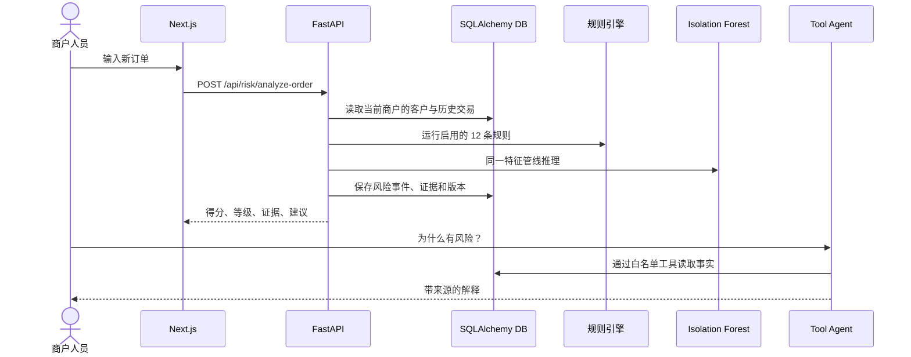

# 系统架构

## 设计目标

TradeGuard AI 将“事实存储、确定性规则、统计/机器学习、自然语言解释”分层，避免让 LLM 成为风险分的来源。任何风险结果都应能回到客户、订单、规则版本、模型版本和特征快照。

## 请求链路

## 模块边界

- `backend/app/api`：HTTP 输入、商户上下文、校验和统一响应。
- `backend/app/repositories`：带 `merchant_id` 过滤的数据访问。
- `backend/app/risk/scoring`：确定性信用评分。
- `backend/app/risk/rules`：可配置、可复现规则，每条返回理由与结构化证据。
- `backend/app/risk/anomaly`：调用 `ml/` 共享特征和模型注册表，提供统计降级。
- `backend/app/agent`：Mock/LLM 路由、白名单工具、来源汇总与安全声明。
- `frontend`：只通过 REST 使用后端；TanStack Query 管服务端状态，Zustand 管界面上下文。

## 数据与隔离

所有核心业务表都保存 `merchant_id`。API 从 `X-Merchant-ID` 读取租户上下文，仓储查询必须带该条件；跨商户 ID 返回 404，减少对象存在性泄漏。生产环境还应增加认证、授权和 PostgreSQL RLS。

## 运行形态

- Docker：PostgreSQL 16、Redis 7、FastAPI、Next.js 四服务。
- 本地演示：SQLite；Redis 超时后记录 `optional-fallback`。
- 模型：磁盘 artifact + JSON 元数据，进程内按修改时间热加载。
