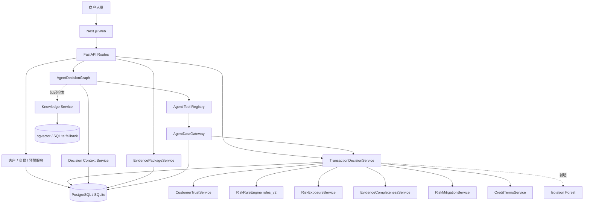
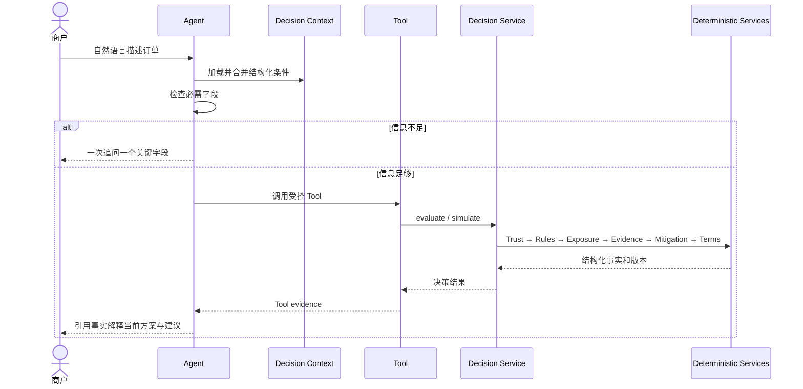

# 系统架构

## 目标与边界

TradeGuard AI 在现有客户、交易、预警和审计 MVP 上增加授信与风险决策能力，没有重写原系统。核心约束如下：

- API Layer 不承载业务算法；
- Agent 不等于 Risk Engine；
- LLM 不等于 Calculator；
- RAG 不等于 Transaction Database；
- Message History 不等于 Decision Context。

## 总体架构

## 决策链

## 模块职责

| 模块 | 职责 | 明确不做 |
|---|---|---|
| `backend/app/api` | HTTP 校验、租户解析、状态码、统一响应 | 风险计算 |
| `backend/app/risk/decision` | 编排全部确定性决策服务 | 自由文本推理 |
| `backend/app/risk/scoring` | Customer Trust v2 与 legacy credit | Agent 回答 |
| `backend/app/risk/rules` | 规则命中、严重度、理由、证据、贡献 | LLM 判断 |
| `backend/app/risk/exposure` | 当前/预计敞口与保障抵扣 | 汇率猜测 |
| `backend/app/risk/evidence` | 必需证据、加权完整度、关键缺失 | 文件真实性自动认定 |
| `backend/app/risk/mitigation` | 已核验保障覆盖 | 伪造 mitigation score |
| `backend/app/risk/terms` | 交易条件建议 | 自动审批 |
| `backend/app/agent` | 抽取、追问、Tool 编排、解释 | SQL、风险评分、写交易 |
| `backend/app/services/evidence_package.py` | 证据快照组合与安全导出 | 重算规则、保存沟通原文 |

## 租户与安全

核心业务、决策上下文、快照和证据包均带 `merchant_id`。API 通过 `X-Merchant-ID` 限定查询；跨租户对象返回 404。Agent 会话与 Decision Context 额外按 `X-User-ID` 隔离。

当前演示环境未实现完整登录鉴权；生产化需增加 OIDC/RBAC、PostgreSQL RLS、对象存储授权、密钥管理和数据保留策略。

## 数据形态

- 结构化业务事实：客户、订单、条款、时间线、证据元数据、缓释、决策快照，进入关系数据库。
- 非结构化知识：案例、操作规范、合同风险经验，切分后进入 `knowledge_base`/pgvector。
- Agent 消息：脱敏后进入 `agent_messages`。
- Decision Context：独立进入 `agent_decision_contexts`，避免从长对话中反复猜测业务字段。

## 运行形态

- Docker：PostgreSQL 16 + pgvector、Redis、FastAPI、Next.js。
- 本地演示：SQLite；向量字段以 JSON 兼容，Redis 可选。
- 模型：Isolation Forest artifact + 元数据；不可用时返回统计辅助信号，不阻断确定性链路。
